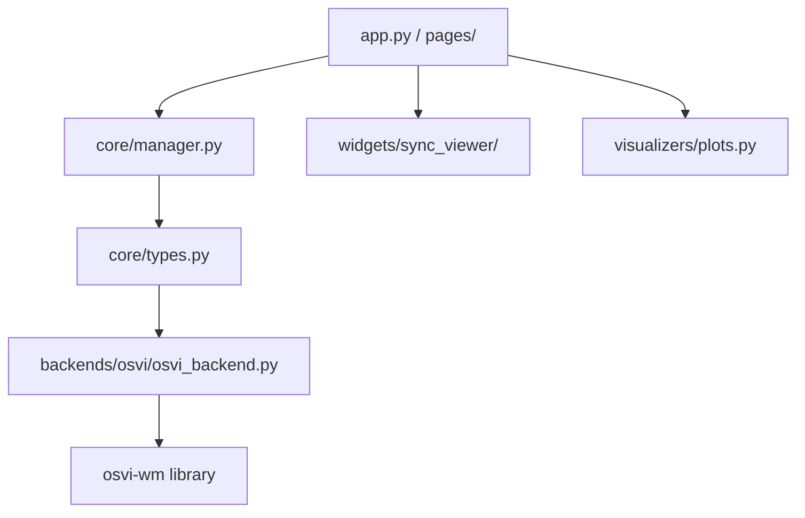

# 🔮 Visual World Model Explorer

An interactive educational platform and neural network debugger designed to help students, researchers, and robotics engineers visually understand predictive latent world models.

---

## 🏗️ Architecture Design



## 🌟 Key Features

- **Neural Network Debugger:** Step sequentially through each neural network module (`Next` / `Previous` controls) to watch the model "think".
- **Spatiotemporal Attention Heatmaps:** Inspect how causal temporal self-attention maps features across time and space.
- **Interactive Softmax Math Sandbox:** Click on grids or slide query/key vectors to calculate spatial softmax expectation values live.
- **Synchronized 3D Viewer:** Synchronized Vue.js/Three.js/Plotly viewer displaying robot 3D predicted path and expert demo video.
- **Pluggable Architecture:** Add any future model (e.g. FastWAM, Demo-JEPA, Dreamer) simply by implementing abstract backend interfaces.

---

## 🛠️ Installation & Setup

1. **Clone the repository:**
   ```bash
   git clone https://github.com/your-username/Visual-World-Model-Explorer.git
   cd Visual-World-Model-Explorer
   ```

2. **Install dependencies:**
   ```bash
   pip install -r requirements.txt
   ```

3. **Configure system paths:**
   Go to the **Settings** page within the application sidebar to set your path to the `osvi-wm` checkpoints and trajectories folder.

---

## 🚀 Quick Start

Launch the Streamlit dashboard:
```bash
streamlit run app.py
```
Open your browser to `http://localhost:8501`.

---

## 🗺️ Implementation Roadmap

- [x] Abstract backend plugin interface
- [x] OSVI-WM backend integration
- [x] Spatiotemporal attention hook extraction
- [x] Live synchronized video and 3D path player widget
- [x] Math formula sandboxes
- [ ] FastWAM active backend support
- [ ] Demo-JEPA active backend support
- [ ] HWM and DreamerV3 support

---

## 📚 Citations
```bibtex
@inproceedings{osviwm2024,
  title={One-Shot Visual Imitation via Latent World Models},
  author={OSVI-WM Contributors},
  booktitle={Robotics and Automation Conference},
  year={2024}
}
```
