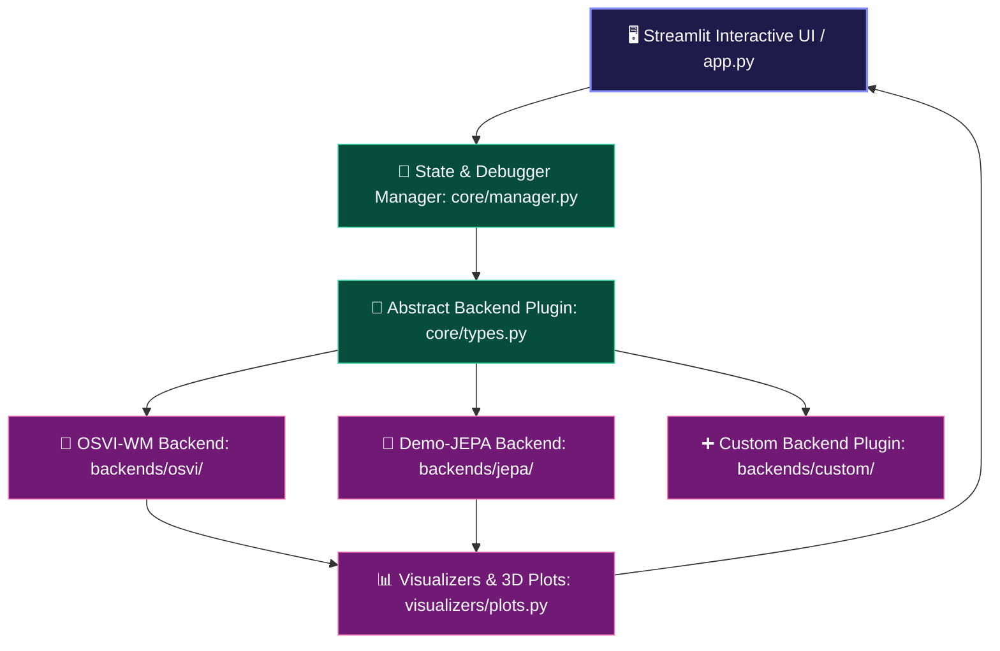

# 🔮 Visual World Model Explorer

An interactive educational platform, neural network debugger, and comparative toolkit designed to help students, researchers, and robotics engineers visually deconstruct and understand predictive latent world models.

---

## 🌟 Overview & Purpose

World Models enable robots to "imagine" the future consequences of their actions in latent feature space before executing them in the physical world. However, deep world model architectures often function as complex black boxes.

**Visual World Model Explorer** breaks open this black box by providing:
1. **Interactive Neural Network Debugger:** Step sequentially through every layer and tensor operation (Encoder, Latent Space, Causal Dynamics, Spatial Softmax, CEM Latent MPC, and Waypoint Heads).
2. **Multi-Model Support:** Compare different world model paradigms side-by-side:
   - **Spatial-Coordinate Latent World Models (e.g. OSVI-WM):** ResNet + Autoregressive Transformer + Differentiable Spatial Softmax.
   - **Joint-Embedding Feature-Space World Models (e.g. Demo-JEPA):** V-JEPA 2.1 ViT-Giant + Dreamer Predictor + Action-Conditioned CEM Latent Planning.
3. **Hardware Grounding & 3D Visualizer:** Synchronized trajectory visualizer showing how abstract latent forecasts translate into physical robot paths (3D Cartesian coordinates and 7-DoF joint deltas).
4. **Interactive Mathematical Sandboxes:** Experiment with differentiable spatial softmax formulas, token attention distributions, and cross-attention matching in real time.

---

## 🏗️ System Architecture



---

## 🔌 Pluggable Architecture

The toolkit uses an extensible plugin architecture (`BaseModelBackend`). You can integrate any new world model (e.g., FastWAM, DreamerV3, Video Diffusion) in three steps:

1. Subclass `BaseModelBackend` in `backends/your_model/` and implement `load_model`, `load_trajectory`, and `run_inference`.
2. Register the backend in `core/manager.py`.
3. Add the model to the selector in `app.py`.

---

## 🛠️ Installation & Quick Start

### 1. Clone the repository
```bash
git clone https://github.com/vivek-v-ingle/Visual-World-Model-Explorer.git
cd Visual-World-Model-Explorer
```

### 2. Install dependencies
```bash
pip install -r requirements.txt
```

### 3. Run the application
```bash
streamlit run app.py
```
Open `http://localhost:8501` in your browser.

---

## 📂 Repository Structure

```text
Visual-World-Model-Explorer/
├── app.py                      # Main entry point & model-isolated dashboard
├── backends/
│   ├── osvi/                   # OSVI-WM backend implementation
│   └── jepa/                   # Demo-JEPA backend implementation
├── core/
│   ├── manager.py              # Central session state & debugger manager
│   ├── types.py                # Abstract BaseModelBackend definition
│   ├── robot_adapter.py        # Robot kinematics & coordinate transformers
│   └── explanations.py         # Mathematical equations & documentation
├── views/                      # Individual neural network debugger & analysis stages
├── visualizers/
│   └── plots.py                # Plotly 3D trajectory & attention heatmap visualizers
├── widgets/                    # Interactive web components (3D sync viewer)
├── tests/                      # Automated verification tests
└── assets/                     # Sample demonstration trajectories
```

---

## 📚 Citations & Academic References

```bibtex
@inproceedings{osviwm2025,
  title={OSVI-WM: One-Shot Visual Imitation for Unseen Tasks using World-Model-Guided Trajectory Generation},
  author={OSVI-WM Contributors},
  booktitle={NeurIPS},
  year={2025}
}

@article{jepa2024,
  title={V-JEPA: Video Joint-Embedding Predictive Architecture},
  author={Assran, Mahmoud and Duval, Quentin and Misra, Ishan and Bojanowski, Piotr and Vincent, Pascal and Rabbat, Michael and LeCun, Yann and Ballas, Nicolas},
  journal={arXiv preprint arXiv:2404.08471},
  year={2024}
}
```

---

## 📄 License
Apache-2.0 License. Open source and free for research and education.
